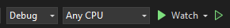

# DAMA POS

## Requirements

- .NET 8
- SQL Server
- EF Core Tools `dotnet tool install --global dotnet-ef` for migrations

## Architecture

1. Vertical Slice Architectur, examples in `Features` folder.
2. Commands & Queries with MediatR to send events. Check CQRS/
3. Bootstrap built in with Blazor for design.
4. InteractiveServer rendering. Check Blazor rendering modes.

## How to Run

- Update `appsettings.json` to have the correct SQL user and password.

```json
  "ConnectionStrings": {
    "DefaultConnection": "Server=.;Database=dama_pos;User Id={user};Password={pass};TrustServerCertificate=True;"
}
```

### Run migrations

```bash
cd .\Dama.POS.Web\
```

```bash
dotnet ef database update
```

### In Visual Studio select `Watch` profile if you want to get hot-reload enabled.



## Migrations

> <b>NOTE:</b> You have to be under `Dama.POS.Web` directory

### Add migration

```bash
dotnet ef migrations add Init --output-dir Application/Database/Migrations
```

### Apply migration

```bash
dotnet ef database update
```
